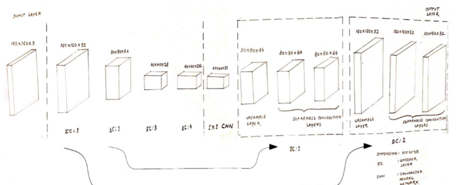
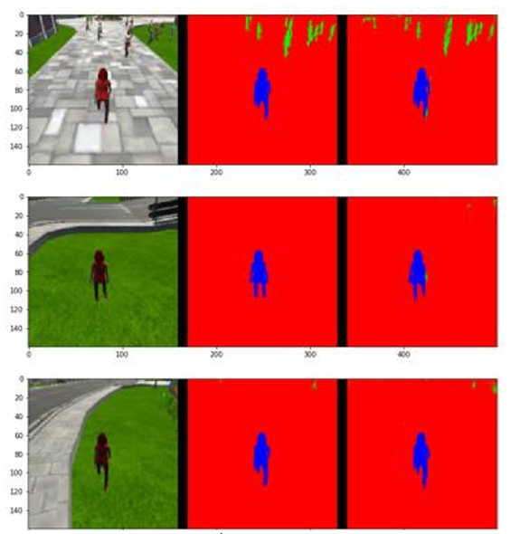
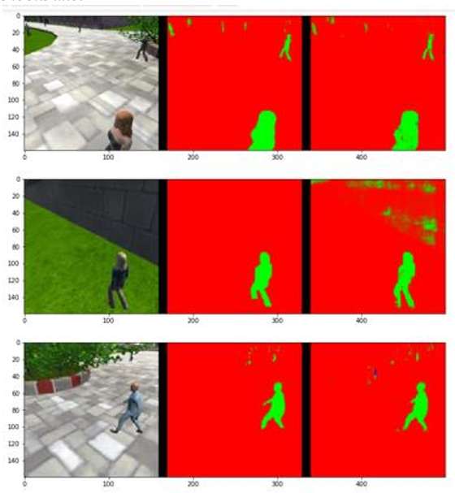

# RoboND Follow Me Project

In this project, a deep neural network model is trained to identify and track a target in simulation. Follow Me applications like this are key to many fields of robotics and the very same techniques applied here, could be extended to scenarios like advanced cruise control in autonomous vehicles or human-robot collaboration in the industry.

## Setup Instructions

**Install Dependencies**

Following frameworks and package dependencies are must to the project for up and running into the system:

* Python 3.x
* Tensorflow 1.2.1
* NumPy 1.11
* SciPy 0.17.0
* eventlet 
* Flask
* h5py
* PIL
* python-socketio
* scikit-image
* transforms3d
* PyQt4/Pyqt5

## Implement the Segmentation Network

### Training, Predicting and Scoring ###

With the training and validation data having been generated or downloaded, the Project is ready with Neural Net training.

**Note**: Training CNNs is a very compute-intensive process. If the system does not have a recent Nvidia graphics card, with [cuDNN](https://developer.nvidia.com/cudnn) and [CUDA](https://developer.nvidia.com/cuda) installed , it may be needed to perform the training step in the cloud. Instructions for using AWS to train the network in the cloud may be found [here](https://classroom.udacity.com/nanodegrees/nd209/parts/09664d24-bdec-4e64-897a-d0f55e177f09/modules/cac27683-d5f4-40b4-82ce-d708de8f5373/lessons/197a058e-44f6-47df-8229-0ce633e0a2d0/concepts/27c73209-5d7b-4284-8315-c0e07a7cd87f?contentVersion=1.0.0&contentLocale=en-us)

## Scoring ##

To score the network on the Follow Me task, two types of error are measured. First the intersection over the union for the pixelwise classifications is computed for the target channel. 

In addition to this we determine whether the network detected the target person or not. If more then 3 pixels have probability greater then 0.5 of being the target person then this counts as the network guessing the target is in the image. 

We determine whether the target is actually in the image by whether there are more then 3 pixels containing the target in the label mask. 

Using the above the number of detection true_positives, false positives, false negatives are counted. 

**How the Final score is Calculated**

The final score is the pixelwise `average_IoU*(n_true_positive/(n_true_positive+n_false_positive+n_false_negative))` on data similar to that provided in sample_evaulation_data

## Experimentation: Testing in Simulation
1. Copy the saved model to the weights directory `data/weights`.
2. Launch the simulator, select "Spawn People", and then click the "Follow Me" button.
3. Run the realtime follower script
```
$ python follower.py my_amazing_model.h5
```
## Results

The schematic representation of the completed training model looks like:



The performance of the trained model for “Images while following the target” over 3 random images looks like: 



The performance of the trained model for “Images while at patrol without target” over 3 random images looks like: 


